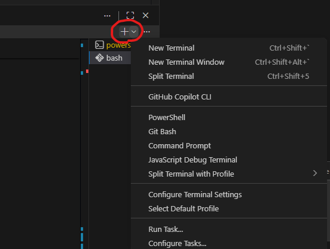
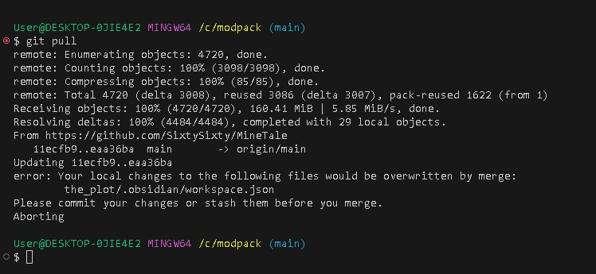

## Гайд по работе с Git и GitHub

В данной заметке изложена гайдлайн по тому, как работать с системой контроля версий (Git), а также взаимодействие с GitHub и проектом через интерфейс (сайт).

---

### Базовый алгоритм работы с проектом (Терминал)

`ctrl + ~` - открыть терминал (или панель слева сверху: Terminal -> New Terminal)

После нужно нажать в окне терминала на иконку стрелочки вниз



После этого в выпавшем списке нажимаем `Git Bash`. Терминал для работы будет готов

**ВАЖНО**: делайте коммиты часто. Не стоит запихивать в один коммит 3 таска. Сделали логическую половину таска - сделали коммит, отправили. Так упрощается разработка и в случае багов, проблем и ошибок откат будет менее болезненным. Т.е. чем больше сохранений (ПО ДЕЛУ) тем лучше.

 1. **Получаем обновления (ПЕРЕД началом работы)**

	> ```bash
	> git pull
	> ```
	
	>*Что это делает: Скачивает все изменения из GitHub и объединяет их с вашими локальными файлами.*
	>
	> Прежде чем что-то менять в файлах, нужно скачать то, что успели сделать другие участники команды. Если этого не сделать, возникнет конфликт.
	> 

	> **ОШИБКА**: Бывает такое, что когда пытаешься сделать git pull он прерывается, так как у тебя есть локальные изменения, которых нет в репозитории, откуда берешь изменения.
	> 
	> 
	> 
	>*Для решения проблемы есть два способа:*
	> 1) `git stash` -> `git pull` -> `git stash pop` - данный способ как бы "игнорирует" ваши локальные правки, позволяя подтянуть изменения, не удаляя ваши 
	> 
	> 2) `git checkout -- путь к файлу без кавычек` - данный способ откатывает изменения выбранного файла до момента последнего коммита

2. **Проверка изменений (ПОСЛЕ того, как что-то изменили в проекте, но до отправки)**

	> ```bash
	> git status
	> ```

	> *Что это делает: Показывает список измененных, удаленных или новых файлов (они будут подсвечены красным).*
	> 
	> Когда вы добавили моды или поправили конфиги, проверьте, какие именно файлы «видит» Git.
	

3. **Добавляем файлы в коммит (ПЕРЕД отправкой в репозиторий)**

	> ```bash
	> git add .
	> ```

	> *Что это делает: Точка в конце означает «добавить все изменения». Теперь файлы в статусе станут зелеными.*
	> 
	> Нужно сказать Git, какие именно изменения мы хотим включить в наше «сохранение» (коммит). Обычно мы берем всё сразу.
	> 
	> *P.S.* Можно также добавлять в коммит файлы по отдельности. Например: `git add файл.txt`. Точка добавляет в коммит ВСЕ *добавленные/измененные/удаленные* файлы.

4. **Создаем «сохранение» (Коммит)**

	>```bash
	>git commit -m "Текст коммита" -m "Новая строка с еще каким-то текстом если есть на то необходимость"
	>```

	>*Что это делает: Создает локальную точку сохранения на вашем компьютере.*
	>
	> **ОЧЕНЬ ВАЖНО:** Прошу и умоляю, пишите коммиты на английском. Это очень важно. В папке рядом лежит файлик с тем, как их писать! (5 минут времени)

5. **Отправляем на GitHub (В конце работы)**

	> ```bash
	> git push
	> ```

	> *Что это делает: Отправляет ваши коммиты в репозиторий на GitHub.*
