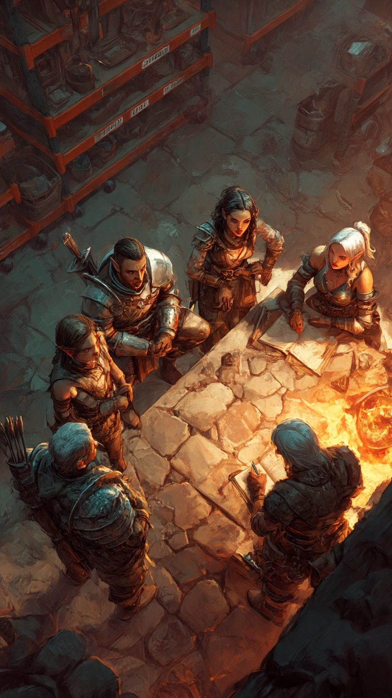

**Дополнительный квест №2.**

**ЗАКАЗ ОТ "НАЛЕТЧИКОВ"** (кавычки должны быть, поскольку на деле эти парни хорошие)
Главный герой идёт по своему пути, проходя различные испытания, побеждая необыкновенных существ и так далее. После прохождения первого дополнительного квеста (спасти _Хафтора_) игрок натыкается на логово "налетчиков" (о нем он узнает из рассказов _Хафтора_, кто на самом деле они такие).         example:
 

Игрок заходит внутрь (это старая пещера, внутри которой обустроено небольшое сооружение из камня). Его замечают налетчики и сразу же окружают, наставляя на него оружие (как должно выглядеть от первого лица: игрока, как только он заходит внутрь, сразу же окружают и наставляют оружие. главный герой оглядывается по сторонам и понимает, что он в патовой ситуации). Стражник, стоящий перед ним, говорит: 
>"Сложи оружие, подними руки, иначе мы тебя прирежем на месте!". 

__(ДАЛЬНЕЙШЕЕ РАЗВИТИЕ СОБЫТИЙ В ДОПОЛНИТЕЛЬНОМ КВЕСТЕ №2 ЗАВИСИТ ОТ РЕЗУЛЬТАТА ДОПОЛНИТЕЛЬНОГО КВЕСТА №1: ПЕРВАЯ ВЕТКА - ИГРОК ВЫБРАЛСЯ ИЗ ТЕМНИЦЫ С _ХАФТОРОМ_; ВТОРАЯ ВЕТКА -  ИГРОК НЕ ВЫПОЛНИЛ ДОПОЛНИТЕЛЬНЫЙ КВЕСТ №1 ИЛИ ЖЕ ПРИ ПРОХОЖДЕНИИ ДОП. КВЕСТА №1 УБИЛ _ХАФТОРА_. ПЕРВАЯ И ВТОРАЯ ВЕТКИ В ИТОГЕ ПРИХОДЯТ К ОДНОМУ РАЗВИТИЮ КВЕСТА, ОНИ НУЖНЫ ДЛЯ  СОХРАНЕНИЯ СЮЖЕТА И КОНТЕКСТА)__   

**ПЕРВАЯ ВЕТКА:**

Далее за игроком следует выбор из __двух вариантов:__
1. Отказаться
В случае отказа ГГ замахивается своим оружием (тем, какое оно у игрока в текущий момент), и его __моментально__ вырубают ударом в голову сзади (как это выглядит: игрок начинает замахиваться, но тут же чувствует удар сзади, его экран темнеет и он падает на пол)
Спустя какое-то время ГГ приходит в сознание, лёжа на старой кровати, и видит перед собой _Хафтора_.

 начинается диалог:

>_Хафтор_: "Прости за моих болванов, они не знали, что я твой должник!"
(_Хафтор_ помнит, что он уже достал крутой доспех для ГГ, однако все ещё считает, что он его должник) (далее диалог):
_Хафтор_: "Рад тебя видеть, дружище! Давай, поднимайся, держи - выпей воды. (кнопка взаимодействия - выпить воды) Как тебя к нам занесло?"
_Игрок_: 1. "Да так, проходил мимо... Не знал, что ты здесь главарь"
         2. "Я искал ваше логово, исходя из твоих рассказов в той проклятой темнице. Не знал, что ты здесь главарь"
_Хафтор_: "Да, всё верно, я главарь сопротивления. Мы называем себя __"Изгнанниками"__ (__"The Exiles"__). Мы хотим свергнуть короля и вернуть власть народу, как когда-то было в старом добром _Элдергруве_. Не желаешь нам помочь?"
2. Согласиться
ГГ складывает оружие, поднимает руки, и вдруг, внезапно, за спинами налетчиков слышится голос:
>"СТОП! ОПУСТИТЕ ОРУЖИЕ! ЖИВО!"

К игроку выходит _Хафтор_ и говорит: 
> "Рад тебя видеть, дружище! Пойдём, я дам тебе выпить воды."

Игрок проходит за _Хафтором_, выпивает воду и начинается диалог:
>_Хафтор_: "Как тебя к нам занесло?"
_Игрок_: 1. "Да так, проходил мимо... Не знал, что ты здесь главарь."
         2. "Я искал ваше логово, исходя из твоих рассказов в той проклятой темнице. Не знал, что ты здесь главарь"
_Хафтор_: "Да, всё верно, я главарь сопротивления. Мы называем себя __"Изгнанниками"__ (__"The Exiles"__). Мы хотим свергнуть короля и вернуть власть народу, как когда-то было в старом добром _Элдергруве_. Не желаешь нам помочь?"  

(переход к одному продолжению из двух вариантов - согласие или отказ):
>_Игрок_: 1. "Да, почему нет. На самом деле, я сюда для этого и пришёл."
        "2. Конечно, я сюда для этого и пришёл."
_Хафтор_: "Отлично, тогда иди за мной". 
(_Хафтор_ даёт игроку карту, на которой изображены: _Элдергрув_, логово "налётчиков" и неизвестная дорога, которая ведёт к какому-то кресту)
_Хафтор_: "Видишь этот крест? Это наше предыдущее логово, но стража из _Элдергрува_ его нашла, убила почти всех моих людей, а затем сожгла. Мои разведчики докладывают, что там сейчас с дюжины стражников. Если ты действительно хочешь нам помочь - ты должен убить их. ВСЕХ! Драгоценности, если они там остались, можешь забрать себе. И ещё: принеси мне шлем одного из стражников, так я смогу тебе отплатить за то, что ты для меня сделал." (_Хафтор_ вдруг стал злым и грустящим в то же время)

**ВТОРАЯ ВЕТКА:**

Далее за игроком следует выбор из __двух вариантов:__
1. Согласиться
Игрок опускает оружие, поднимает руки и начинается диалог:
>Налётчик: "КТО ТЫ И ЗАЧЕМ СЮДА ПРИШЁЛ?!"

Далее два развития диалога: 1 - если игрок убил _Хафтора_ во время прохождения **доп. квеста №1**, 2 - если игрок не проходил **доп. квест №1**

1. Игрок убил _Хафтора_ во время прохождения **доп. квеста №1**
>Игрок: "Меня заключили в темницу _Элдергрува_ и я находился в ней вместе с _Хафтором_. Он мне рассказывал про логово налетчиков. Полагаю, я его нашёл..."
>Налётчик: "_ХАФТОР_?! ТЫ ЕГО ЗНАЕШЬ?! ЧТО С НИМ?! ГДЕ ОН?! ГОВОРИ, УРОД!"
Игрок: "Мне... пришлось убить его. Стража до конца запудрила ему мозги, и он не узнал меня, когда я пришёл его вытащить из этой проклятой темницы... Мне жаль, правда."
Налётчик: "ЧТО?? НЕТ! ТОЛЬКО НЕ НАШ ГЛАВАРЬ..."
(все налётчики впали в отчаяние)
Налётчик: "Я поверю тебе на слово, ведь я знаю, на что спомобен этот чёртов король _Элдергрува_. Но если ты пытаешься меня обмануть..."
Игрок: "Сочувствую вашей утрате, _Хафтор_ был хорошим парнем. Но я не просто так сюда пришёл. Я хочу вам помочь отомстить!
Изгнанник (именно изганник): "_Хафтор_" прозвал нас "**изгнанниками**". Мы - последняя группа сопротивления и борьбы с проклятым королем _Элдергрува_. Ладно, идём за мной. 

2. Игрок не проходил **доп.квест №1**
>Игрок: "Я просто проходил мимо, пощадите!"
>Налётчик: "ЧТО ТЕБЕ НУЖНО?!"
Игрок: "А кто вы такие?.."
Налётчик: "Мы - **изгнанники** - сопротивление и борцы с текущей властью в _"Элдергруве"_
Игрок: "_Элдергрув_... знакомое название... я могу быть вам полезен."
Изгнанник (именно изганник): "Да, вполне. Идём за мной."

(переход от двух вариантов диалога к одному:)
Изгнанник: "Возьми эту карту (кнопка взаимодействия). Видишь на ней изображён крест? Этот крест - наше предыдущее логово - твоя задача. Стражники из _Элдергрува_ убили там половину наших людей, а затем сожгли логово, будьте они прокляты. Наши разведчики докладывают, что там сейчас находится с дюжину стражников. Ты должен убить их ВСЕХ, а всё, что там найдешь, можешь забрать себе. И ещё кое-что: принеси мне шлем одного из стражников, я тебе заплачу." 

2. Отказаться 
Игрок отказывается опустить свои руки, замахивается своим текущим оружием и его моментально убивают. Игрока моментально убивают налётчики, а затем игрок возраждается на последней контрольной точке и продолжается линия из согласия (выше).

**ДВЕ ВЕТКИ ВЫТЕКАЮТ В ОДНУ:**
Игрок получает карту от налетчика или же _Хафтора_ и принимается за выполнения задачи. Игрок выходит из логова и начинает следовать по дороге, указанной на карте. Найдя предыдущее логово налетчиков, ГГ видит перед собой стражу. Он ее убивает (минимальный требуемый уровень - 15), заходит внутрь логова и видит перед собой сожженую землянку. Там он находит полезные сокровища - еду, воду и ресурсы. Убив всю стражу, игрок подбирает шлем одного из них, и возвращается обратно в логово "изгнанников". _Хафтор_ или "изгнанник", в зависимости от предыдущей ветки, принимаект этот шлем и предлагает игроку его кастомизировать: изменить внешний вид, дать бафф и так далее

**КОНЕЦ ДОП. КВЕСТА №2**