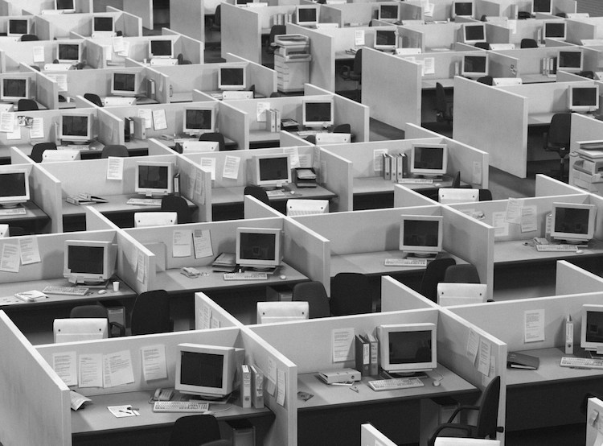
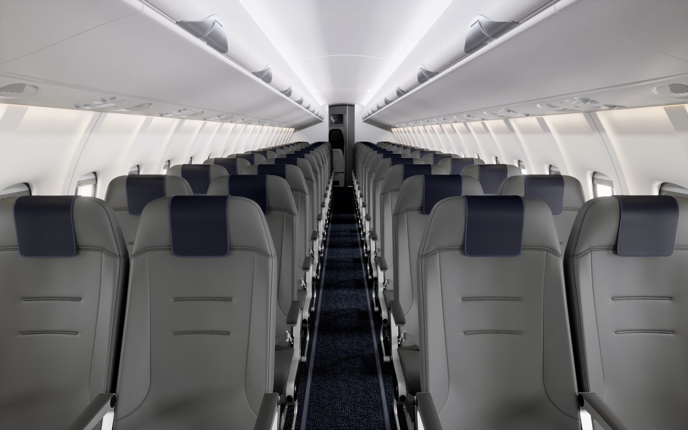
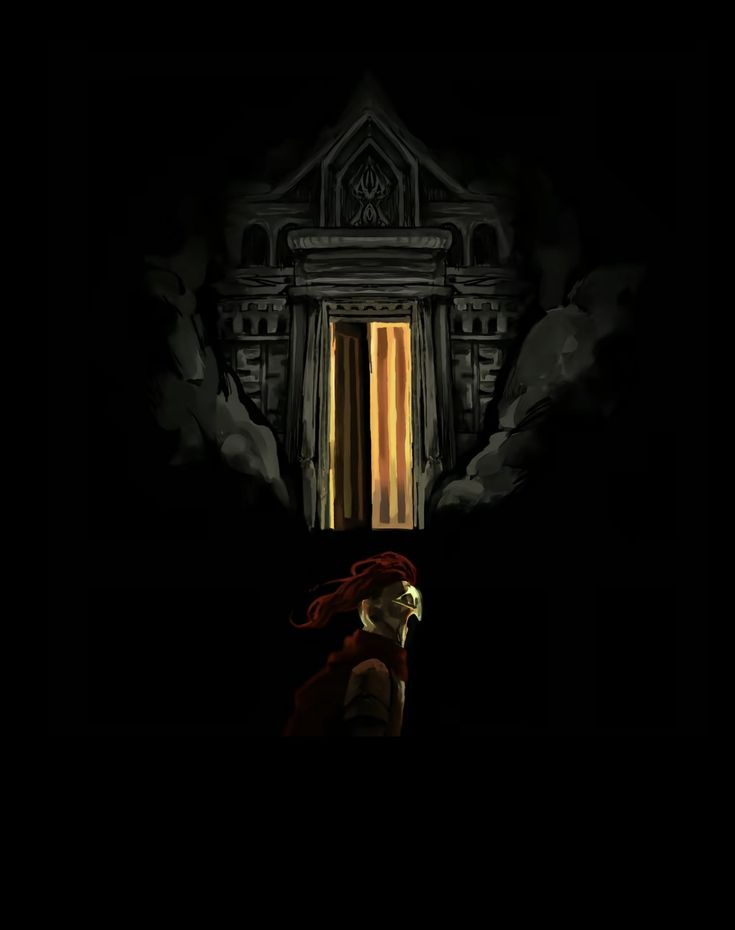

## Пролог

По нажатию кнопки "play" и загрузки, игрок наблюдает следующую картину: черный экран, пронзительный звонок будильника, приоткрытые глаза героя, серый потолок квартиры. Герой поворачивает голову, где за окном квартиры все кажется таким же абсолютно серым, таким же и собственная квартира героя. Игрок получает управление над героем и ему необходимо выполнить несколько дел (квест) перед выходом из квартиры на работу. В этот момент автоматически принимается следующий квест:

### Квест: "О новый дивный день. Часть I"

1. Принять душ
2. Позавтракать
3. Собраться на работу

> Данный игровой элемент реализовываться будет нами разработчиками. В данном случае необходимо будет воссоздать квартиру, нанести фильтр и добавить катсцены, которые будут активироваться при взаимодействии с предметами (душ, холодильник, шкаф). В данных катсценах будет демонстрироваться действия игрока (завтрак, открытия шкафа с одеждой, принятия душа в душевой кабине). ВАЖНО: все катсцены должны проигрываться от 1-го лица (от лица игрока)

После выполнения выше поставленных задач из квеста, игрок переносится в офис (ниже приложена картинка того, как он выглядит)

Войдя в офис, герой наблюдает, как каждый из присутсвующих в офисе уткнулся в собственный монитор, не наблюдая ничего вокруг себя самого.

Когда игрок попадает в офис, квест обновляется:

### Квест: "О новый дивный день. Часть I" -> Найдите свое рабочее место и приступите к работе.

> У игрока появляется метка, куда ему требуется направится (плюс-минус аналогичная механика, как в различных open-world rpg-шках)

По прибытию к своему рабочему месту, игрок нажимает кнопку для взаимодействия с комьютером, после чего у него проигрывается катсцена в +- x3 режиме скорости, сменяя цикл утра до позднего вечера, демонстрируя то, насколько однообразно проходит день главного игрока.

Катсцена заканчивается, игрок попадает на порог своей квартиры. Квест обновляется:

### Квест: "О новый дивный день. Часть I" 

1. Переодеться
2. Поужинать
3. Принять душ
4. Лечь спать

> При выполнении 4-го пункта игроку необходимо подойти к кровати, нажать на кнопку взаимодействия с кроватью, а после начнет воспроизводиться катсцена того, как игрок ложиться спать

После выполнения всего этого, герой снова просыпается от звона будильнка. Начиная день по новой, не отличающийся абсолютно ничем от предыдущего.

На третий день, по приходу на работу, когда игрок доходит до своего рабочего места, герой замечает на столе лист бумаги, на котором изложено постановление, где босс его компании уведомляет его об очередной ему предстоящей командировке по улаживанию неких вопросов компании в N-ой стране.

После прочтения проигрывается диалог:

-- Очередная командировка? `*`
-- Как же мне они уже надоели.

> `*` - переключение диалога на следующий. Первый и тот что ниже последовательно проигрываются друг за другом.

### Квест: "О новый дивный день. Часть II"

После того, как прогрываются диалоги, экран чернеет, начинает светлеть с большой надписью: **СПУСТЯ 2 ДНЯ**, а после игрок оказывается в салоне взлетающего самолета.

После этого воспроизводится следующим диалог:

*Игрок*: Сколько летаю, а до сих пор боюсь высоты. 
*Игрок*: С другой стороны это последняя и после можно уже будет уйти в отставку.
*Игрок*: И получить долгожданный покой. 
*Игрок*: Пожалуй, решение сейчас вздремнуть будет лучшим из всех в этой ситуации.
*Игрок*: ... (да, такая строчка диалога, выражающая паузу)
*Игрок*: Поскорее бы все это закончилось...

Затем глаза героя закрываются и на 3-4 секунды снова гаснет экран. 
Вдруг игрок резко открывает глаза, слыша крики, человеческий шепот и чувствуя панику. Как вдруг пилот самолета обращается к пассажирам на борту:

*Пилот*: Уважаемые пассажиры, просим успокоиться. Наш самолет попал в некоторую зону торбулентн...
*Пилот*: (происходит резкий толчок и слышни крики и возгласы)
*Пилот*: Снова вас просим успокоиться, ведь это абсолютно штатная ситуация. Повторяю, штатная ситуаци...

Не успевшись завершится объявление на борту, самолет резко дает огромную трещину прямо рядом с главным героем, происходит разгерметизация. В дыру улетает: багаж, люди, обшивка и прочее. Весь самолет дрожит, везде слышни лишь возгласы, крики, молитвы и мольбы о пощаде.

В этот момент, героя выбрасывает из самолета и он чувствует...свободу? Он летит вниз головой с огромной скоростью, ощущая свою беспомощность. В этот момент в его голове проскальзывает лишь одна мысль, затем он произносит следующие слова: 

*Игрок*: Какая же...
*Игрок*: несправедливость...

Вдруг, ожидая удара, герой осознает, что он в невесомости. Он чувствует как время, будто бы застыло вокруг него. Он открывает глаза, все вокруг стало абсолютно серым, бледным и тусклым, будто потеряв весь свой цвет. Игрок хочет дернуться, попытаться повернуть голову или же руку, но у него ничего не выходит. Он лишь слышит, видит и чувствует. 

И в этот момент, в воздухе перед собою он видит **ВРАТА**.

> Тут с точки зрения эффетка надо сделать так, что пространство вокруг врат абсолтно черное, в пределах 5-10 блоков, будто бы тьма окутывает их. В свою же очередь окружение не меняется и игрок в том же мире. Также важно воссоздать будет именно такие врата, так как это канон (дальше будет объяснение почему)

Не успев еще осознать происходяще, в его голове звучит шопот из тысячи голосов, каждый из них шепчет и кричит, произнося в унисон следущие слова:

*Голос*: НЕСП..РАВЕД..ЛИВО..СТЬ
*Голос*: ЧТ..О. ЕСТЬ. НЕСПР..АВЕД..ЛИВОСТЬ. ЧЕ..ЛОВЕК.

*Игрок*: (выбор ответа)
1. Что?..
2. Вся моя жизнь это несправедливость. 
3. Я..я не знаю.
4. Есть закон карающий виновных.

*Голос*: (вариант овтета взависимости от выбора)
1. ОТВ..ЕТЬ. ЧЕЛО...ВЕК. `->` *переход к предыдущему выбору, без 1-го варианта ответа*
2. ДА. К СО..ЖА..ЛЕНИЮ. ВЕР..НО `->` *переход к блоку A*
3. НЕСПРАВ..ЕДЛИВОСТЬ. ЭТО. ПО..РОК. ПОР..ОК. ПРИ..СУЩИЙ. НЕ. ТОЛЬ..КО. ЛЮ..ДЯМ. НО И БОЖЕ..СТВАМ. ПОРОК. ВСЕ..ГО. СУЩЕГО. В. МИ..РОЗДАНИИ. `->` *переход к блоку A* 
4. ЕРЕ..СЬ! ЕР..ЕСЬ! ЕРЕСЬ!`->` *переход к блоку B*

---

**БЛОК А**

*Голос*: ТЫ. К..АК. НИКТ..О. ДР..УГОЙ. ПРОЧУВСТ..ВОВАЛ. Н..А. СЕБЕ. НЕСПРАВЕДЛИВОСТЬ.
*Голос*: Т..Ы. ВЕ..Л. ПР..ВЕДНУЮ. ЖИЗ..НЬ. РАБО..ТАЯ. НЕ. ПО..КЛАДАЯ. РУ..К.
*Голос*: И. ЧТ..О. ТЫ. ПОЛ..УЧИЛ. ВЗА..МЕН. З..А. СВ..ОЙ. Т..РУД. ЧЕЛ..ОВЕК.
*Голос*: ПРЕДАТЕЛЬСТВО.
*Голос*: ЭТ..ОТ. ПРОК..ЛЯТЫЙ. МИ..Р. И. САМА. СУД..ЬБА. ТЕБЯ. ПРЕ..ДАЛИ.
*Голос*: ТЕБЯ. ИСПОЛЬ..ЗОВАЛИ. ТЕБЯ. БР..ОСИЛИ. ТЕБЯ. УНИ..ЗИЛИ.
*Голос*: РАЗ..ВЕ ТЫ. ЭТОГО. НЕ. ОСОЗН..АЛ. НА. ГР..АНИ. ЖИЗНИ. И. СМЕ..РТИ.
*Игрок*:
1. Пожалуй, ты прав. Я не сделал ничего плохого, чтобы заслужить подобную смерть.
2. Не знаю даже. Это лишь неудачное стечение обстоятельств.

*Голос:* 
1. ИМЕН..НО. ЧЕЛ..ОВЕК. `->` *переход к блоку ниже* 
2. РА..ЗВЕ? ТЫ. Т..АК. НАИВ..НО. В. Э..ТОМ. УВЕ..РЕН. ЧЕЛ..ОВЕК. `->` *переход к блоку ниже*

*Голос*: ПРЕД..СТАВЬ. СКО..ЛЬКО. ВСЕГ..О. ТЫ. ЕЩЕ. Н..Е. СД..ЕЛАЛ.
*Голос*: НЕ. ПОЧУВС..ТВОВАЛ. Н..Е. УВ..ИДЕЛ. НЕ. УСП..ЕЛ.
*Голос*: ВЫСШ..ИЕ. С..ИЛЫ. У. ТЕ..БЯ. ВСЕ. ОТОБ..РАЛИ. ДО. П..ОСЛЕДНЕЙ. КАПЛ..И.
*Голос*: СУД..ЬБА. Т..ЕБЯ. ПОКАР..АЛА. НЕ. ДАВ. ША..НСА. НА. ИСКУПЛЕ..НИЕ. И. РА..ДИ. Ч..ЕГО.
*Голос*: ВС..Е. РАДИ. МНИМОГО. БАЛАНСА.
*Голос*: ВОТ. ЧТ..О. ЕС..ТЬ. И..СТИННАЯ. НЕС..ПРАВЕДЛ..ИВОСТЬ.

*Голос*: ПО..ЗВОЛЬ. МН..Е. ПР.ОТЯНУТЬ. ТЕБ..Е. РУК..У. ПО..МОЩИ.
*Голос*: И. ПРЕД..ПОДНЕСТИ. Д..ВА. МОИ..Х. ДА..РА.
*Голос*: ША..НС. Н..А. С..ЧАСТЛИ..ВУЮ. Ж..ИЗНЬ.
*Голос*: И. МЕС..ТЬ. КАР..У. ОТ..МЩЕНИЕ. ЗА. ИСТ..ИННУЮ. НЕ..СПРАВ..ДЕЛИВОСТЬ.

*Игрок*: 
1. Я согласен. `->` *переход в заметку prologue_part2*
2. Прости, но я давно для себя все решил. Я не хочу мести. Я хочу покоя. `->` *переход  блоку ниже*

*Голос*: НЕ. СТОИТ. РАЗБРАСЫВАТЬСЯ. ТАКИМИ. СЛОВАМИ. ЧЕЛОВЕК.
*Голос*: НЕ. КАЖ..ДЫЙ. ДЕ..НЬ. ДАЖ..Е. У. Б..ОЖЕСТВ. ПОЯВ..ЛЯЕТСЯ. ВТО..РОЙ. ШАН..С.
*Голос*: ХО..РОШО. ПОДУМ..АЙ. П..ЕРЕД. ПРИН..ЯТИЕМ. РЕШЕНИ..Я.

*Игрок*: 
1. Прошу прости меня за эти слова. Мой рассудок совсем от нервов помутнился. Я согласен.`->` *переход в заметку prologue_part2*
2. Я останусь при своем решении и мнении. Я не ищу мести или второй жизни. `->` *Переход к блоку С на метку `!`*

---

**БЛОК Б**

*Голос*: КАР..АЮЩИЙ. ВИНОВНЫ..Х. Ч..ТО. ТЫ. ЗНА..ЕШЬ. О. ВИ..НЕ. И. ПРОСТ..УПКЕ. С..МЕРТН..ЫЙ. 
*Голос*: КА..К. ТЫ. СМ..ЕЕШЬ. ИМЕТЬ. ТА..КИЕ. СУЖД..ЕНИЯ. НИЧТОЖЕСТВО.
*Голос*: КТ..О. Е..СТЬ. СУДЬ..Я. ИМ..ЕЮЩИЙ. ПРАВО. КАР..АТЬ.
*Голос*: КТ..О. Е..СТЬ. ВИН..ОВНЫЙ. ЗАСЛУ..ЖИВАЮ..ЩИЙ. БЫ..ТЬ. НА..КАЗАННЫМ.
*Голос*: ХОТЯ. ТЫ. КА..К. ЛЮБ..ОЕ. ЖИВОЕ. СУЩЕС..ТВО. ИМЕЕШЬ. ША..НС. НА. УСКУП..ЛЕ..НИЕ. И. ПРОЩЕН..ИЕ.
*Голос*: Д..АЖЕ. ЗА. ТА..КИЕ. МЫСЛ..И.
*Голос*: ПОЗВО..ЛЬ. МНЕ. ТЕ..БЕ. П..ОМОЧЬ. ЗАПЛУТА..ВШЕЕ. ДИТЯ.
*Голос*: Я. ПО..МОГУ. ТЕ..БЕ. ОБ..РЕСТИ. ИСТИН..НУЮ. СПР..АВДЕЛИ..ВОСТЬ. ПОЗ..НАТЬ. ЕЕ. И. ПОЧУ..ВСТВ..ОВАТЬ.

*Игрок*:
1. Прошу. Помоги мне. `->` *переход к блоку А*
2. Пф, сдалась мне твоя помощь! Я лучше сдохну, чем буду просить у тебя помощь.`->` *переход к блоку С*

---

**БЛОК С**

*Голос*: Х..А..-ХА..-Х..А-ХА..-...ХА
*Голос*: НАСК..ОЛЬКО. ЛЮ..ДИ. ЗДЕ..СЬ. ПР..ИМИТИВНЫ. НАИВ..НЫ. ГЛУПЫ.
*Голос*: Я. ДАЮ. ТЕБ..Е. ША..НС. К. ИСК..УПЛЕНИЮ.
*Голос*: ПОД..УМАЙ. В. ПОС..ЛЕДНИЙ. РАЗ. И. СД..ЕЛАЙ. ПРА..ВИЛЬНЫЙ. ВЫ..БОР.

*Игрок*:
1. Прошу прости меня за слова эти. Мой рассудок совсем от нервов помутнился. `->` *переход к блоку A*
2. Помогай себе сам. Свою судьбу я уже давно определил. `->` *переход к диалогу ниже*

`!` - метка для диалога из *блока А*

*Голос*: БУДЬ. ПО. ТВ..ОЕМУ. НИЧ..ТОЖНОЕ. СУЩЕСТ..ВО. 
*Голос*: НЕЛ..ЕПАЯ. СМЕРТЬ. НА. ЖАЛК..ИХ. СОБСТВ..ЕННЫХ. УСЛО..ВИЯХ.
*Голос*: ПРОЩ..АЙ. И. БУДЬ. П..РЕДАН. ЗАБВЕН..ИЮ.
*Голос*: НАВЕЧНО.

После этих слов, врата испоряются и игрок снова чувствует поток ветра обвалакивающий его тело. Он летит прямиком вниз, рассекая воздух и пространство, произнеся свои последние слова за доли секунд до столкновения с землей:

> Будет очень круто, если параллельно этому полету будет играть музыка на фоне. Очень подошла бы тема с пианино или что-то в этом роде

*Игрок*: Интересно, что оно хотело от меня?

> Экран резок темнеет, после чего появляется логотип нашей сборки и ниже идут титры. Мы благодарим игрока за столь быстрое прохождение игры. Было бы круто, если мы какую-то косметику добавили за это или давали предмет в следующем прохождении игры на старте (что-то простенькое)