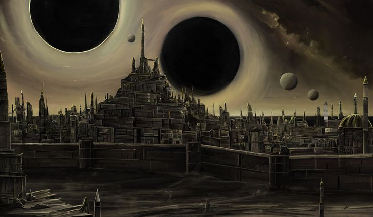
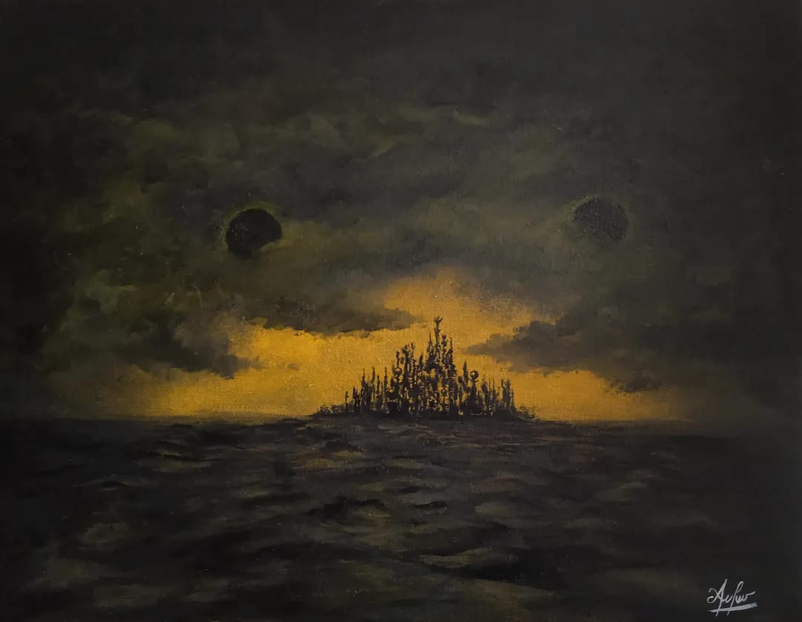
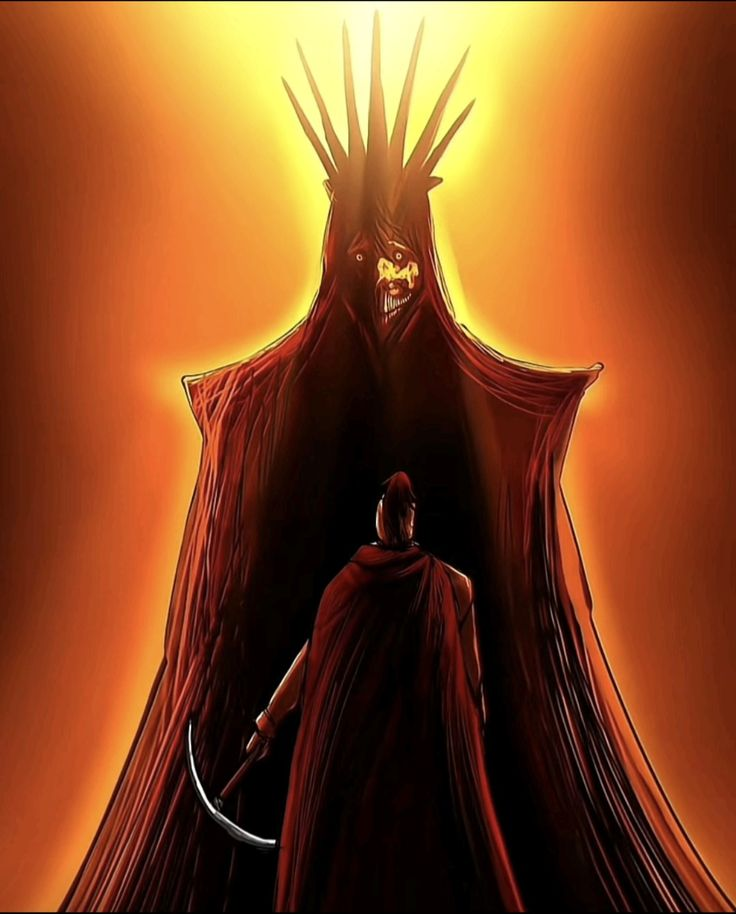
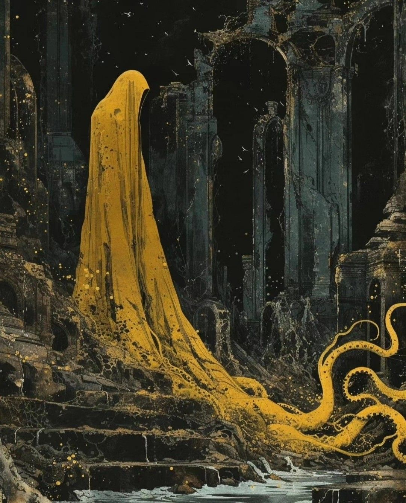
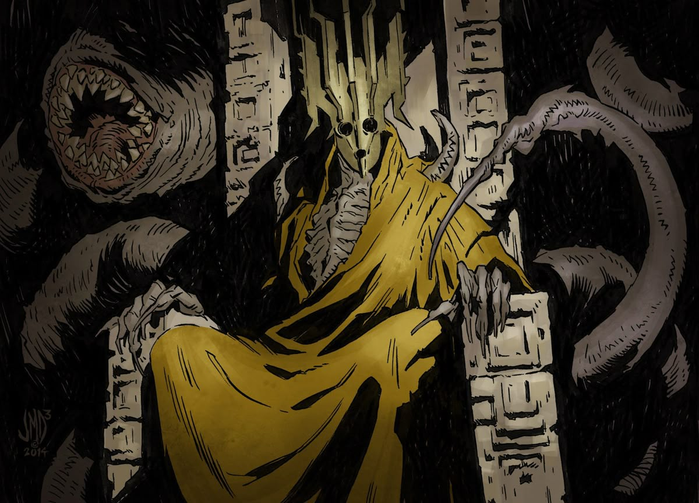
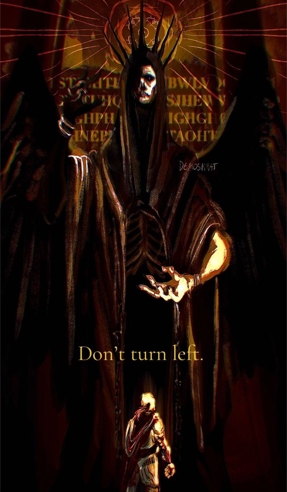
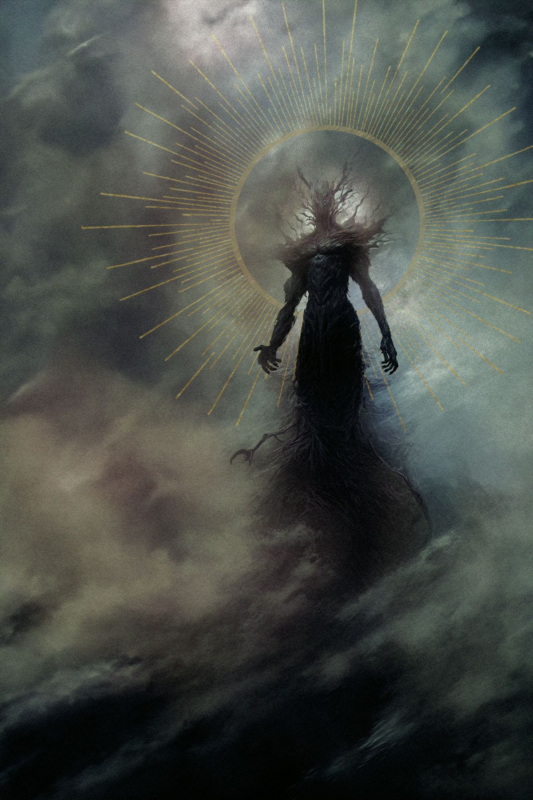

## Пролог. Часть II

После того, как игрок соглашается на предложение врат, его зрение искажается. Будто бы все пространство вокруг него сжимается и его затягивает в чуть-чуть приоткрытые двери врат. 

Все резко погружается во мрак. 

Герой не видит абсолютно ничего, но он по прежнему слышит этот пронзительный и затяжной непрекращающийся шопот. Еще пару секунд и он резко прекращается. Наконец-то долгожданная тишина в голове.

Затем резко загорается небо. Игрок видит абсолютно черное небо, рассченное золотистыми полосами, будто оставленные кем-то шрамы. На нем видно два, некогда ярких, но теперь уже давно потухших, небесных светила, поглощающих весь свет и искажая пространство подле себя, пытаясь каждое мгновенье пожрать все пространство вокруг.

После чего игрок переводит взгляд на место где он сам находится. Это храм. Вернее то, что от него осталось. Величественные и необычайной красоты колонны подпирающие теперь разве что небо, стены которые можно перешагнуть, пол покрытый безжизненными корнями, голой землей и мертвой травой.

Все это место кричит о том, что давным-давно в этом место пришла смерть и забрала за собою все, что могла.

Осмотрев храм, герой видит силует. По форме он напоминает человека. Ростом метра от 2.5 до 3 метров. Он облачено с ног до головы желтым плащом с капющоном. На его голове величаво сидит корона, настолько черная, будто она поглащает и искажет весь окружающий ее свет. На лице красуется белая маска с абсолютно пустыми желтыми глазами. В некоторых местах (грудь, руки) видна кожа, натянутая до предела, на его кости. Серая и безжизненная, как у живого мертвеца. 

Он безмолвно стоит лицом к игроку, заглядывая ему будто в душу, пробирая героя до самых костей.

Герой чувствует лишь одно, смотря на нее в ответ: **СТРАХ**.

В его глазах он видит только **БЕЗДНУ**, **БОЛЬ** и ... скорбь.

> В этот момент необходимо сделать так, чтобы экран игрока дрожал, а взгляд приблежался постепенно к лицу существа
 
С каждой секундой шопот становится все громче, пока не перерастает в истошные крики и мольбы о смерти.

И в миг они резко затихают.

После существо отворачивается спиной к игроку, переводя свой взор к руинам на горизонте.

Там герой видит невероятного огромный город-крепость. Здания в городе имеют непревзойденную архитектуру и убранство. Судя по их состоянию это лишь отголоски былой великой нации. Остались лишь древние руины, производящие лишь остаточный эффект от былого успеха и триумфа. Весь город это огромное кладбище, которое по сей день остается безмолвным, забытым, разрушенным и брошенным. 

После нескольких мгновений молчания, существо решает заговорить. Каждое его слово, это все тот же унисон из тысяч, а может и более голосов звучащих прямо в голове героя, повторяющих шопотом его слова: 

*Существо*: ЧТО. ТЫ. ВИДИШЬ. ЧЕЛОВЕК?

*Игрок*: 
1. Руины.
2. Империю.
3. Былое величие
4. Эммм...город?

*Существо*:
1. ДА. РУИНЫ. НЕКОГДА. ВЕЛИКОЙ. ИМПЕРИИ.
2. ДА. БЫЛУЮ. ИМПЕРИЮ. ЗАБЫТУЮ. РАЗРУШЕННУЮ. ПРЕДАННУЮ. ЗАБВЕНИЮ.
3. ...
4. НЕ. ПРОСТО. ГОРОД. ИМПЕРИЮ. ВЕЛИЧАЙШУЮ. ИЗ. ВСЕХ.

*Игрок*:
1. Где мы?
2. Что это за город?
3. Что здесь произошло?
4. Кто ты?

*Существо*: 
1. МИР. МЕЖДУ. МИРОВ. КОНЕЦ. КОНЦА. ПУСТОТА. ЧИСТИЛИЩЕ.
2. КАСТОРИЯ. ВЕЛИЧАЙШЕЕ. ИЗ. ВСЕХ. ЧЕЛОВЕЧЕСКИХ. ГОСУДАРСТВ. МОЙ. ДОМ.
3. ПРОКЛЯТЬЕ. НЕБЕС.
4. ТЫ. УВЕРЕН. ЧТО. ХОЧЕШЬ. УЗНАТЬ? `->` *переход к блоку НИЖЕ*

> В этот момент шопот перерастает в истошные крики

*Существо*: Я. ВЕЛИЧАЙШИЙ. ГРЕШНИК. И. ОТСТУПНИК.
*Существо*: Я. ТОТ. КТО. БРОСИЛ. НЕБЕСАМ. ВЫЗОВ.
*Существо*: Я. ТОТ. КТО. ДОСТИГ. НЕВОЗМОЖНОГО. РАЗВЯЗАВ. ВОЙНУ. С. САМИМИ. БОГАМИ.
*Существо*: Я. ТОТ. КТО. ОБЪЕДИНИЛ. СИЛЬНЕЙШИХ. И. УМНЕЙШИХ. ИЗ. ВСЕХ. ЛЮДЕЙ. С. ОДНОЙ. ЦЕЛЬЮ.
*Существо*: ПОДЧИНИТЬ. СЕБЕ. СУДЬБУ. И. ПРИНЕСТИ. ИСТИННУЮ. СПРАВЕДЛИВОСТЬ. В. ЭТОТ. МИР.
*Существо*: И. Я. ТОТ. КТО. ПОНЕС. ЗА. ЭТО. НАКАЗАНИЕ.
*Существо*: НЕСПРАВДЕЛИВОЕ. И. ОМЕРЗИТЕЛЬНОЕ. ВО. ВСЕЙ. СВОЕЙ. СУТИ.
*Хастур*: ИМЯ. МНЕ. **ХАСТУР**. **БОГ НАДЗИРАТЕЛЬ**. **КОРОЛЬ АНДАЛОВ**. **ВЛАДЫКА КАСТОРИИ**. **ПОВЕЛИТЕЛЬ ВСЕХ ЛЮДЕЙ**. 
*Хастур*: ПРОКЛЯТЫЙ. САМИМИ. НЕБЕСАМИ. ЗА. СВОЕ. СТРЕМЛЕНИЕ. К. СПРАВЕДЛИВОСТИ.

*Игрок:* Но зачем я тебе? Для чего ты меня спас?

> Дальше точек между словами не будет, но они там должны быть. Мне лень их ставить.
 
*Хастур*: ЧТОБЫ. ТЫ. ПРИНЕС. В. ЭТОТ. МИР. ИСТИННУЮ. СПРАВЕДЛИВОСТЬ.
*Хастур*: ...
*Хастур*: МЫ С ТОБОЮ ОЧЕНЬ ПОХОЖИ. НАВЕРНЯКА ТЕБЕ ПРОБЛЕМНО ЭТО ОСОЗНАВАТЬ.
*Хастур*: МЫ ОБА ТРУДИЛИСЬ НЕ ПОКЛАДАЯ РУК
*Хастур*: МЫ ОБА ЖЕЛАЛИ МОМЕНТА ТРИУМФА. ПОБЕДЫ.  
*Хастур*: И ОБА БЫЛИ ЖЕСТОКО НАКАЗАНЫ ЗА ЭТО СТРЕМЛЕНИЕ
*Хастур*: НЕСПРАВДЕЛИВО. НЕСПРАВЕДЛИВО. НЕСПРАВЕДЛИВО. НЕСПРАВЕДЛИВО. НЕСПРАВЕДЛИВО.

*Хастур*: МОЙ ДОМ. МОЯ ИМПЕРИЯ. МОЙ НАРОД. ВСЕ ЭТО ПРЕВРАТИЛОСЬ В ПРАХ.
*Хастур*: РАЗВЕ ЭТО СПРАВЕДЛИВОСТЬ. РАЗВЕ ЭТО БАЛАНС. РАЗВЕ ЭТО ПОРЯДОК.
*Хастур*: СУДЬБА ЕСТЬ ИСТИННАЯ НЕСПРАВЕДЛИВОСТЬ.

*Игрок*: Что ты подразумеваешь под судьбой? 

*Хастур*: СУДЬБА. ЗАКОН ПО КОТОРОМУ ВСЕ СУЩЕЕ ЖИВЕТ И ЭВОЛЮЦИОНИРУЕТ.
*Хастур*: В ТВОЕМ МИРЕ ЛЮДИ СЧИТАЮТ ЕЕ ПРЕДОПРЕДЕЛЕНИЕМ ЖИЗНИ СУЩЕСТВА И ЕГО ПУТИ. ЭТО ЛИШЬ ПРАВДА ОТЧАСТИ.
*Хастур*: НА САМОМ ДЕЛЕ СУДЬБА ЭТО ОГРАНИЧИТЕЛЬ. ОНА НЕ ПОЗВОЛЯЕТ СМЕРТНЫМ РАЗВИВАТЬСЯ ВЫШЕ ДОЗВОЛЕННОГО УРОВНЯ.

*Игрок*: Для чего она была создана? Зачем препятствовать развитию?

*Хастур*: СУДЬБА НЕОБХОДИМА ПО МНЕНИЮ БОЖЕСТВ ДЛЯ ПОДДЕРЖАНИЯ РАВНОВЕСИЯ И БАЛАНСА ВО ВСЕМ МИРОЗДАНИИ.
*Хастур*: ЭТО ЗАКОН ЛИШЬ ОБЕРЕГАЕТ БОЖЕСТВ. ОН ИМ НУЖЕН ПОТОМУ КАК ОНИ БОЯТСЯ И СТРАШАТСЯ СПОСОБНОСТЕЙ СМЕРТНЫХ.
*Хастур*: Я И МОЙ НАРОД БЫЛИ ОДНИМИ ИЗ ТЕХ КТО ОСМЕЛИЛСЯ НАРУШИТЬ ЭТОТ ЗАКОН РЕШИВ САМОСТОЯТЕЛЬНО ВЫБИРАТЬ СЕБЕ ПУТЬ И ДИКТОВАТЬ СВОИ ПРАВИЛА.

*Игрок*: И что случилось после?

*Хастур*: ТО ЧТО ТЫ ВИДИШЬ ПЕРЕД СОБОЮ.
*Хастур*: ПРОКЛЯТЬЕ. НЕБЕС.
*Хастур*: В ТОТ ДЕНЬ ЗА МГНОВЕНИЕ ВСЯ ИМПЕРИЯ ПЕРЕМЕСТИЛАСЬ В ЭТО ПРОСТРАНСТВО. В ЧИСТИЛИЩЕ. ВСЕ НЕБЕСА НАД ГОРОДОМ. ПОКРЫЛИСЬ ЭТОЙ ТЬМОЙ.
*Хастур*: А ЗАТЕМ В НЕБЕ ПОЯВИЛСЯ ОН. ВЛАДЫКА СУДЬБЫ. СОЗДАТЕЛЬ ВСЕГО СУЩЕГО. БОЖЕСТВО ИЗ БОЖЕСТВ.
*Хастур*: **АО**.

*Хастур*: КАСТОРИЯ ПАЛА ПОЧТИ СРАЗУ. МОЙ НАРОД ЗАКЛЕЙМИЛИ. НАЗВАВ ИХ ГРЕШНИКАМИ. А ЗАТЕМ ИСТРЕБИЛИ. ТЕХ КТО ВЫЖИЛ **ОН** ПРЕВРАТИЛ В ОМЕРЗИТЕЛЬНЫХ ТВАРЕЙ ЛИШИВ ИХ РАССУДКА. 
*Хастур*: ВСЕ ЗНАНИЯ НАКОПЛЕННЫЕ ЗА ТЫСЯЧИЛЕТИЯ БЫЛИ СТЕРТЫ И ПРЕДАНЫ ЗАБВЕНИЮ.
*Хастур*: Я МОЛИЛ О ПОЩАДЕ. ПРОСИЛ ШАНСА НА ИСКУПЛЕНИЕ. ПОЩАДЫ МОЕГО НАРОДА. НО ОН МЕНЯ ДАЖЕ НЕ СЛУШАЛ. 
*Хастур*: **АО** АБСОЛЮТНО БЕЗМОЛВНО ПОМЕСТИЛ В МОЙ РАЗУМ ДУШИ ВСЕХ ТЕХ КТО ПОГИБ В ТОТ ДЕНЬ В КАЧЕСТВЕ НАКАЗАНИЯ. 
*Хастур*: **ОН** МЕНЯ СДЕЛАЛ СВОЕЙ МАРИОНЕТКОЙ. ОЧЕРЕДНЫМ БОЖЕСТВОМ ПОДЧИНЯЮЩИМСЯ ЕМУ. СОБАКОЙ НА ПРИВЯЗИ ПРИГЛЯДЫВАЮЩЕЙ ЗА ЕЩЕ ОДНИМ ИЗ ЕГО МИРОВ.
*Хастур*: И КАЖДОЕ МГНОВЕНИЕ Я СЛЫШУ ГУЛ ИЗ ИХ КРИКОВ. КАЖДЫЙ ИЗ НИХ МОЛИТ О СМЕРТИ ПО СЕЙ ДЕНЬ. А Я БЕССИЛЕН. Я НЕ СПОСОБЕН УПОКОИТЬ ИХ ДУШИ. 

*Игрок*: Ты хочешь уничтожить этого бога?

*Хастур*: НЕТ...НЕ СЕЙЧАС.
*Хастур*: СЕЙЧАС Я ХОЧУ ИСКОРЕНИТЬ ИСТИННУЮ НЕСПРАВЕДЛИВОСТЬ.
*Хастур*: ХОЧУ УНИЧТОЖИТЬ ПУТЫ СУДЬБЫ.
*Хастур*: НО НАМ БОЖЕСТВАМ В ПОДЧИНЕНИИ У АО ДОЗВОЛЕНО ЛИШЬ НАБЛЮДАТЬ ЗА НАШАМИ МИРАМИ И ДОКЛАДЫВАТЬ О ПРОИСХОДЯЩЕМ В НИХ.  
*Хастур*: ИМЕННО ПОЭТОМУ ДЛЯ ДОСТИЖЕНИЯ МОЕЙ ЦЕЛИ ТЫ МНЕ И НУЖЕН.
*Хастур*: В ТОЙ КАТАСТРОФЕ В КОТОРУЮ ТЫ ПОПАЛ ПРОИЗОШЛО МНОЖЕСТВО ЖЕРТВ ЗА ОЧЕНЬ КОРОТКИЙ ПРОМЕЖУТОК ВРЕМЕНИ.
*Хастур*: ЭТО ПОДАРИЛО МНЕ ВОЗМОЖНОСТЬ ТЕБЯ ВЫЗВОЛИТЬ ОТТУДА НЕ ВЫЗЫВАЯ ПОДОЗРЕНИЙ НА НАРУШЕНИЕ НЕБЕСНЫХ ПУТ. К ТОМУ ЖЕ ТВОЕЙ ПРОПАЖИ СКОРЕЕ ВСЕГО НИКТО НЕ ЗАМЕТИЛ.

> Небесные путы - закон запрещающий Богам влиять на события в мирах подвластным АО. 

*Хастур*: Я ХОЧУ ЧТОБЫ ТЫ МНЕ ПОМОГ В ОБМЕН НА МОЮ ПОМОЩЬ ОКАЗАННУЮ ТЕБЕ.
*Хастур*: НО СЕЙЧАС НЕ ВРЕМЯ ДЛЯ ЭТОГО. КОГДА НАСТУПИТ ЧАС НУЖДЫ Я СНОВА ТЕБЯ ВЫЗОВУ К СЕБЕ И МЫ ОБСУДИМ МОЮ ПРОСЬБУ.
*Хастур*: ТЫ ОТПРАВИШЬСЯ В МИР ПОД НАЗВАИЕМ *АРДА*. В МОЙ РОДНОЙ МИР. 
*Хастур*: СЕЙЧАС НАД МИРОМ СЛЕДИТ ГАЛЬГАМЕШ. МОЙ ДРУГ И СОРАТНИК. РАЗДЕЛЯЮЩИЙ МОИ ВЗГЛЯДЫ НА СУДЬБУ И СПРАВЕДЛИВОСТЬ. 
*Хастур*: ПОТОМУ ТВОЕ ПОЯВЛЕНИЕ НЕ ВЫЗОВЕТ ЯРКИХ ПОДОЗРЕНИЙ НА НЕБЕСАХ.
*Хастур*: ВОСПОЛЬЗУЙСЯ ЭТИМ ШАНСОМ ОБРЕСТИ НОВУЮ СЧАСТЛИВУЮ ЖИЗНЬ.
*Хастур*: И ПОМОГИ МНЕ ПРИНЕСТИ В ЭТОТ МИР ИСТИННУЮ СПРАВЕДЛИВОСТЬ.

После этих слов за спиной игрока появляются врата. Такие же, какие были в небе во время падения. Одна из дверей приоткрыта, будто зазывая героя войти.

Много времени не теряя игрок проважает взглядом Хастура, все также наблюдающим за мертвыми руинами своего города, и отправляется на встречу к новой жизни!

